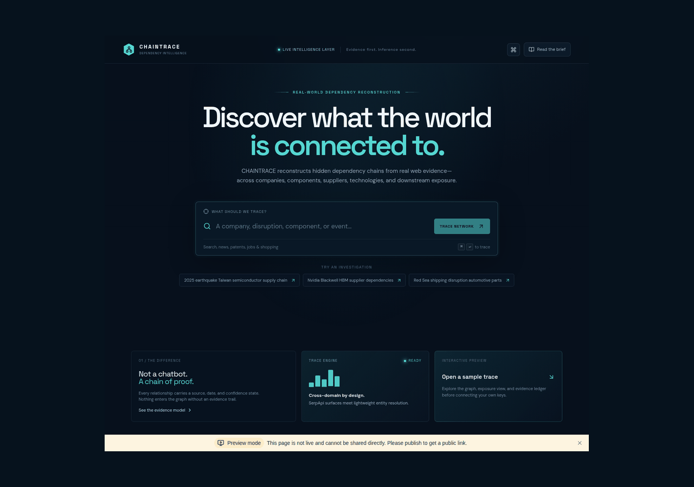
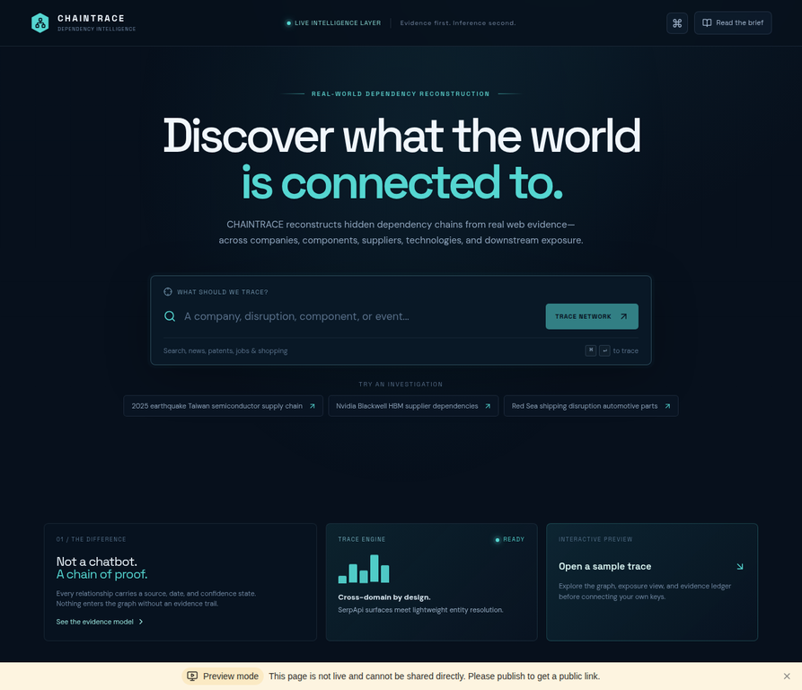
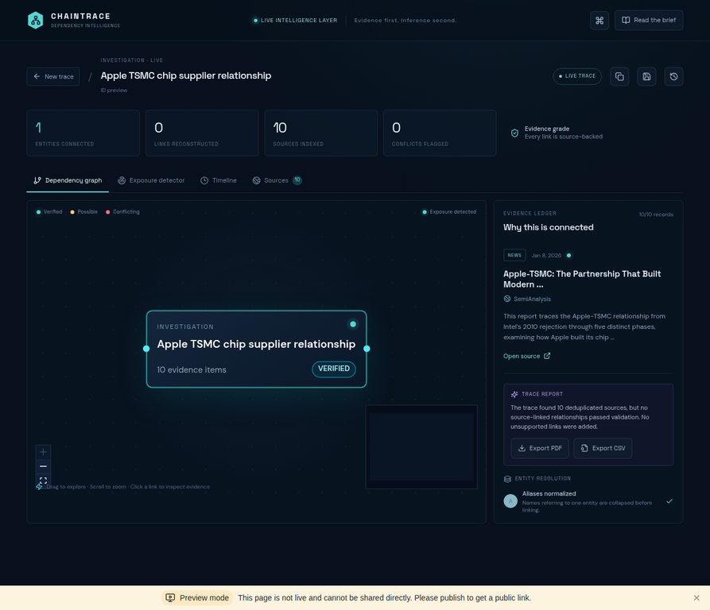
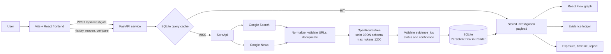

# CHAINTRACE — Discover what the world is connected to.

> **Evidence first. Inference second.** CHAINTRACE reconstructs real-world dependency chains from live web evidence across events, companies, technologies, components, suppliers, products, and industries.

## Product Preview



| Landing experience | Live trace dashboard |
|---|---|
|  |  |

The GIF shows the verified interface flow from query intake through live trace progress to the evidence-backed result dashboard. The live screenshot includes the graph, source ledger, trace report, and evidence-linked result state.

**Dashboard screenshot caption.** The live dashboard shows the investigation query **“Apple TSMC chip supplier relationship.”** SerpApi returned 10 indexed source records, visible in the evidence ledger, while the resulting React Flow canvas contains the investigation anchor and no relationship edges because no source-linked relationship passed validation for that run. The trace report explicitly preserves this zero-edge result rather than presenting an unsupported Apple–TSMC connection as fact.

## Overview

A real-world event rarely stays inside one category. A chip shortage can affect a supplier, a component, a manufacturer, and a downstream product at the same time. The difficult part is not finding isolated facts; it is connecting them while preserving the evidence trail.

CHAINTRACE turns a natural-language investigation query into a compact, source-backed dependency trace. It retrieves current Google Search and Google News results through SerpApi, removes duplicate or unusable records, asks OpenRouter's free router for strictly structured relationship candidates, validates every cited evidence ID, stores the complete result in SQLite, and renders the result as an interactive React Flow graph with an evidence ledger, exposure view, timeline, and report.

## Why CHAINTRACE

CHAINTRACE is designed as an investigation surface rather than a general-purpose chatbot. The application separates retrieval from inference, keeps the model input compact, and refuses to add graph edges that cannot be tied back to retrieved source IDs. This makes the result inspectable: users can move from a relationship to the evidence records and then to the original source URL.

The system is useful for quick dependency reconnaissance, supply-chain research, technology landscape review, disruption analysis, and hackathon demonstrations where a polished visual trace must remain grounded in live evidence.

## How It Works

```text
User Query
    ↓
Vite + React frontend
    ↓
FastAPI /api/investigate
    ↓
SerpApi: Google Search + Google News
    ↓
URL validation, deduplication, compact evidence records
    ↓
OpenRouter/free: one strict JSON relationship-extraction call
    ↓
Evidence-ID validation + SQLite persistence/cache
    ↓
React Flow dependency graph
    ↓
Evidence ledger, exposure view, timeline, sources, and report
```

For local preview compatibility, the Node/Express host also contains a legacy investigation path. When `FASTAPI_API_URL` is configured, its investigation and saved-investigation routes proxy to FastAPI. In the deployed architecture, the frontend uses `VITE_API_BASE_URL` to call the FastAPI service directly.

## Key Features

| Feature | What is implemented |
|---|---|
| **Dependency Graph** | React Flow graph with investigation and entity nodes plus labeled, animated relationship edges. |
| **Exposure Detection** | Exposure markers and an exposure view for entities directly supported by the current evidence set. |
| **Hidden Dependency Discovery** | Relationship candidates are extracted from compact retrieved evidence rather than from the query alone. |
| **Entity Resolution** | Entity labels are normalized and reused when graph nodes are constructed. |
| **Evidence Ledger** | Search/news records show title, source, type, date, snippet, status, and an original source link. |
| **Timeline** | The result includes investigation anchor, evidence retrieval, and relationship-linking stages. |
| **Source Provenance** | Every accepted relationship carries one or more `evidence_ids`; each ID maps to a stored source record. |
| **Evidence Status** | `VERIFIED`, `POSSIBLE`, and `CONFLICTING` are supported for relationship and graph status. |
| **Caching** | Identical queries are keyed by a normalized SHA-1 query hash and return a SQLite cache `HIT` without repeating upstream calls. |
| **Evidence Filters** | The UI can filter retrieved records by the available source-type labels, including Search and News when present. |
| **Saved / Reopen** | Investigations receive stable IDs, appear in recent history, and can be reopened from SQLite. |
| **Comparison** | Two stored investigations can be compared for shared entities, unique entities, and shared relationship labels. |
| **Exports** | The UI provides client-side PDF trace-report and CSV evidence-ledger downloads. |
| **Preview** | An explicitly labeled illustrative preview demonstrates the interface; it is not presented as live evidence. |

## Architecture



## Tech Stack

| Layer | Technology |
|---|---|
| Frontend | React 19, Vite 7, TypeScript, Tailwind CSS 4, Framer Motion, Lucide, Wouter |
| Graph | `@xyflow/react` / React Flow |
| API | FastAPI 0.115, Uvicorn, Pydantic 2, HTTPX |
| Local host / proxy | Node.js, Express, TypeScript, tRPC scaffold |
| Retrieval | SerpApi Google Search and Google News engines |
| Structured extraction | OpenRouter API with `OPENROUTER_MODEL=openrouter/free` |
| Persistence | SQLite via Python's standard-library `sqlite3` module |
| Deployment | Render Blueprint, Python web service, static Vite frontend, Render Persistent Disk |
| Testing | Vitest, TypeScript checks, Python verification scripts |

## SerpApi Integration

The production FastAPI service makes two concurrent SerpApi requests for a cache miss:

1. `engine=google` reads `organic_results` for general web evidence.
2. `engine=google_news` reads `news_results` for news evidence.

Each record must contain an `http://` or `https://` URL. Records are normalized to a compact shape containing an evidence ID, title, source, source type, date, snippet, status, and URL. Duplicate URLs are removed and the final evidence set is capped at 10 records. The current backend does not call SerpApi patents, jobs, shopping, or other engines; those labels exist only as UI filter vocabulary for matching source-type records if supplied by a future retrieval surface.

## OpenRouter Integration

The application uses:

```text
OPENROUTER_MODEL=openrouter/free
```

`openrouter/free` is the only configured model route. There is no paid model fallback in the application. OpenRouter is used for one compact relationship-extraction call per cache miss. The prompt includes at most eight evidence records and only their IDs, titles, URLs, source types, dates, and short snippets. The request uses a strict JSON schema and a `max_tokens` limit of `1200`.

The API accepts only relationships whose `subject`, `object`, and `evidence_ids` are present and whose evidence IDs match the retrieved records. A valid response may contain zero relationships; in that case CHAINTRACE reports the evidence and does not create unsupported graph edges. Free-router provider selection and output quality can vary.

## Data Flow

1. The user submits a query of 3–240 characters from the React frontend.
2. FastAPI normalizes the query and checks SQLite using a lowercase, trimmed SHA-1 hash.
3. A cache `HIT` returns the stored payload without calling SerpApi or OpenRouter.
4. On a `MISS`, FastAPI requests Google Search and Google News results concurrently through SerpApi.
5. Results without valid URLs are discarded; duplicate URLs are removed and records are compacted.
6. Up to eight compact evidence records are sent in one structured OpenRouter/free request.
7. Returned relationships are validated against real evidence IDs, confidence, and allowed status values.
8. React Flow nodes and edges are created only from validated relationships.
9. The complete live payload is stored in SQLite and returned to the frontend.
10. The UI renders the graph, evidence ledger, sources, exposure, timeline, report, and optional exports.

## Evidence and Provenance

Every normalized evidence record has a stable ID derived from its URL and is marked `VERIFIED` when it passes URL validation. A relationship must cite at least one of those IDs to enter the graph. The edge stores the relationship label, status, confidence, and `evidence_ids`; the UI can use those IDs to show the supporting source records.

Relationship status values are constrained to:

- **VERIFIED** — direct support is asserted by the structured extraction response and confidence is at least `0.75`.
- **POSSIBLE** — weaker support, lower confidence, or a response that does not meet the verified threshold.
- **CONFLICTING** — supplied sources are represented as directly disagreeing by the structured response.

The backend drops relationships with missing entities or missing/invalid evidence IDs. It does not synthesize unsupported edges when OpenRouter fails, returns malformed JSON, or returns no usable relationships.

## API Configuration

Create a local `.env` file or configure the equivalent Render environment variables. Use placeholders only; never commit real keys.

```dotenv
SERPAPI_API_KEY=
OPENROUTER_API_KEY=
OPENROUTER_MODEL=openrouter/free
SQLITE_PATH=./backend/chaintrace.sqlite
CORS_ORIGINS=http://localhost:5173

# Frontend / proxy wiring when running the separate services locally or on Render:
VITE_API_BASE_URL=http://localhost:8000
FASTAPI_API_URL=http://localhost:8000
```

`SERPAPI_API_KEY` and `OPENROUTER_API_KEY` are server-side secrets. They must not be placed in frontend source or exposed through `VITE_` variables.

## Local Setup

The repository uses pnpm for the Node/React application and Python for FastAPI.

```bash
git clone <repository-url>
cd chaintrace
pnpm install

python3 -m venv .venv
source .venv/bin/activate
pip install -r backend/requirements.txt
```

The repository ignores `.env`, SQLite files, build output, and dependency directories. Keep local secrets in an ignored `.env` file.

## Running the Frontend and Node Host

For the existing Vite/React development experience:

```bash
pnpm dev
```

The script runs `NODE_ENV=development tsx watch server/_core/index.ts`, which starts the Node host and Vite bridge. If `VITE_API_BASE_URL` is set, the browser calls the configured FastAPI origin. If it is not set, the local Node host can use its compatibility investigation path.

## Running FastAPI

Run the production investigation API directly in a second terminal:

```bash
source .venv/bin/activate
uvicorn backend.main:app --reload --port 8000
```

Health check:

```bash
curl http://localhost:8000/health
```

Live investigation example:

```bash
curl -X POST http://localhost:8000/api/investigate \
  -H 'content-type: application/json' \
  --data '{"query":"Apple TSMC supplier relationship"}'
```

## API Endpoints

| Method | Endpoint | Purpose |
|---|---|---|
| `GET` | `/health` | Returns service status and configured model value. |
| `POST` | `/api/investigate` | Runs or retrieves a cached investigation. |
| `GET` | `/api/investigations` | Lists recent stored investigations and metrics. |
| `GET` | `/api/investigations/{id}` | Reopens a stored investigation by stable ID. |
| `POST` | `/api/investigations/compare` | Compares two stored investigations by ID. |

The investigation request body is `{ "query": "..." }`. Common failure responses include `503` for missing configuration, `502` for upstream failures, `404` for empty valid-source results, and `400` for invalid local-host requests.

## Testing

The repository includes:

```bash
pnpm check
pnpm test
python3 -m py_compile backend/main.py backend/verification_test.py
python3 backend/verification_test.py
python3 render_yaml_check.py
```

`pnpm test` runs the Vitest suite for authentication logout behavior, credential reachability, and the Node investigation contract. The FastAPI verification script covers the live production-flow contract and failure cases including empty results, SerpApi failures, OpenRouter failures, malformed JSON, duplicate evidence, missing source URLs, evidence-ID validation, cache behavior, stable IDs, reopening, and comparison. The credential test reaches SerpApi and OpenRouter using server-side environment variables; it does not print secret values.

## Production Build

```bash
pnpm build
```

This runs `vite build` for the static frontend and bundles the Node/Express host with esbuild into `dist/index.js`.

## Render Deployment

`render.yaml` defines the existing two-service deployment without adding a separate database service:

- `chaintrace-api`: Python web service rooted at `backend/`, started with Uvicorn.
- `chaintrace-frontend`: static Vite build published from `dist/public`.

The FastAPI service mounts a 1 GB Render Persistent Disk at `/var/data` and uses:

```text
SQLITE_PATH=/var/data/chaintrace.sqlite
OPENROUTER_MODEL=openrouter/free
```

Configure these Render variables:

| Variable | Purpose |
|---|---|
| `SERPAPI_API_KEY` | Server-only SerpApi credential. |
| `OPENROUTER_API_KEY` | Server-only OpenRouter credential. |
| `OPENROUTER_MODEL` | `openrouter/free`; no paid fallback is configured. |
| `SQLITE_PATH` | `/var/data/chaintrace.sqlite` on the Persistent Disk. |
| `CORS_ORIGINS` | Exact deployed frontend origin. |
| `VITE_API_BASE_URL` | Render injects the FastAPI service URL into the frontend build. |

The frontend must call the deployed FastAPI URL through `VITE_API_BASE_URL`; the API must allow only the deployed frontend origin through `CORS_ORIGINS`. See [`RENDER_SMOKE_TEST.md`](RENDER_SMOKE_TEST.md) for the production `MISS` → `HIT`, response-parity, disk-persistence, and CORS checks.

## Project Structure

```text
chaintrace/
├── backend/
│   ├── main.py                 # FastAPI API, retrieval, extraction, graph payloads, SQLite
│   ├── requirements.txt        # FastAPI runtime dependencies
│   ├── verification_test.py    # Production-flow and failure-case verification
│   └── disk_path_check.py      # Persistent-disk path check
├── client/
│   ├── src/pages/Home.tsx      # Landing page, live flow, graph, ledger, exports, history
│   ├── src/index.css           # Dark intelligence-console design system
│   └── src/App.tsx             # Application shell and routes
├── server/
│   ├── investigation.ts        # Local Node compatibility investigation path
│   └── _core/index.ts          # Express host, FastAPI proxy, Vite/static serving
├── render.yaml                 # Render FastAPI + static frontend Blueprint
├── RENDER_SMOKE_TEST.md        # Post-deployment smoke-test procedure
├── package.json                # pnpm scripts and frontend/server dependencies
├── pnpm-lock.yaml              # Locked Node dependency graph
└── drizzle/                    # Scaffolded auth/database schema area
```

## Demo Flow: Three Minutes

1. Open CHAINTRACE and choose a real investigation such as `Apple TSMC supplier relationship` or `Nvidia Blackwell HBM supplier dependencies`.
2. Submit the query and show the staged live trace while FastAPI retrieves Google Search and Google News evidence.
3. Review the dependency graph and explain that live edges appear only when OpenRouter's structured output cites valid evidence IDs.
4. Open the evidence ledger, inspect a source URL, and switch to the exposure and timeline views.
5. Copy or save the investigation ID, reopen it from recent investigations, and demonstrate that the identical request returns from SQLite without repeating upstream calls.
6. Optionally export the trace report as PDF or the evidence ledger as CSV.

The landing-page sample trace is explicitly illustrative. It must not be presented as a live investigation result.

## Limitations

- `openrouter/free` is a free router and its provider/model selection and extraction quality can vary. A live request can legitimately return evidence with zero validated relationships.
- SerpApi availability, quotas, latency, and result quality affect live investigations.
- Search/news coverage is limited to the two currently implemented SerpApi engines; the UI vocabulary includes additional source-type filters, but the backend does not query those additional engines today.
- SQLite is appropriate for this single-service, disk-backed deployment and cache workload, but it is not a substitute for a horizontally scalable multi-writer database.
- The graph reflects retrieved evidence and validated extraction output, not a guaranteed exhaustive view of the real world.
- The frontend production bundle currently emits a Vite chunk-size warning; the build still completes successfully.
- The demo preview contains illustrative data and is intentionally separate from live evidence.

## Future Improvements

- Add more retrieval surfaces with explicit source-type adapters and provenance rules.
- Add stronger model/provider observability while preserving the free-only configuration when required.
- Introduce background refresh or incremental evidence updates for long-running investigations.
- Improve graph layout and relationship-level evidence interaction for larger traces.

## Security

- Keep `SERPAPI_API_KEY` and `OPENROUTER_API_KEY` server-side only.
- Use environment variables or Render secret configuration; never commit `.env` files or real credentials.
- The FastAPI request model bounds query length and rejects undersized input.
- Evidence URLs are validated before records enter the graph, and relationship evidence IDs are validated before edges are created.
- Configure `CORS_ORIGINS` with the exact frontend origin rather than a wildcard in production.
- The SQLite file should live on the Render Persistent Disk and should not be exposed as a static asset.

## License

This repository declares the **MIT License** in `package.json`. Add the standard MIT license text to a root `LICENSE` file before distribution if it is not already present in the repository.

## Acknowledgements

CHAINTRACE uses [SerpApi](https://serpapi.com/) for Google Search and Google News retrieval, [OpenRouter](https://openrouter.ai/) for structured relationship extraction through `openrouter/free`, [FastAPI](https://fastapi.tiangolo.com/) and [Uvicorn](https://www.uvicorn.org/) for the Python API, [React](https://react.dev/), [Vite](https://vite.dev/), and [Tailwind CSS](https://tailwindcss.com/) for the frontend, [React Flow](https://reactflow.dev/) for graph visualization, and [SQLite](https://www.sqlite.org/) for local and disk-backed persistence.

---

**CHAINTRACE** keeps the interface polished, the evidence compact, and the inference inspectable.

> **Evidence first. Inference second.**
